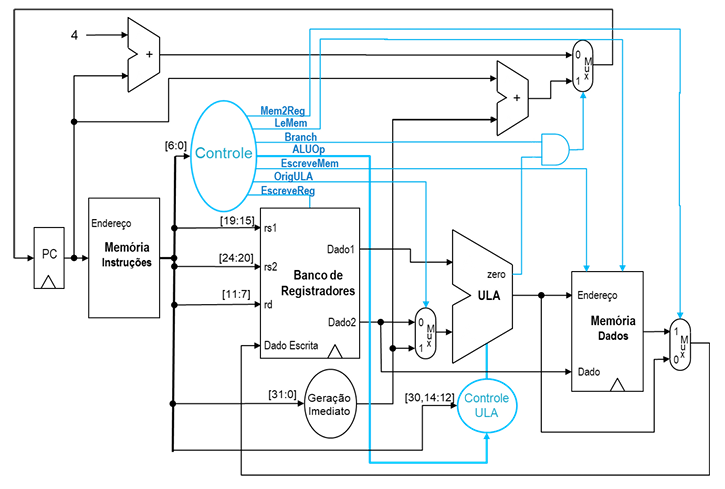

# Laboratório 2 - CPU RISC-V UNICICLO

## Objetivos

- Treinar o aluno com a Linguagem de Descrição de Hardware (HDL) Verilog;
- Familiarizar o aluno com o software de síntese **QUARTUS Prime v24.1**;
- Desenvolver a capacidade de análise e síntese de sistemas digitais usando uma HDL;
- Implementar uma CPU Uniciclo compatível com a ISA **RV32I reduzida**.

---

## <small>(10.0)</small> **1.** Implementação do Processador Uniciclo

Implemente o processador Uniciclo com ISA Reduzida com as instruções: **add, sub, and, or, slt, lw, sw, beq, jal**, e ainda as instruções **jalr, addi e lui**.

O projeto **TopDE.qar** possui o arcabouço para o desenvolvimento e teste do seu processador.

---

### <small>(1.0)</small> **1.1.**  Código de Teste

Analise o programa `de1.s` que testa a corretude da implementação de todas as 9 + 3 instruções e teste no RARS.  

>**Dica:** O registrador `t0` é usado para visualizar resultados!

---

### <small>(1.0)</small> **1.2.** Banco de Registradores

Implemente o Banco de Registradores com 3 leituras simultâneas: `rs1`, `rs2` e `disp`.
- Stack Pointer (sp) inicial: 0x1001_03FC

---

### <small>(1.0)</small> **1.3.** Gerador de Imediatos
Implemente o Gerador de Imediatos.

---

### <small>(0.5)</small> **1.4.** Memória de Dados e Instruções

No **Rars16_Custom2**, vá em **File / Dump Memory** e exporte (MIF 32 Format) para o arquivo de1 (sem extensão). Os arquivos `de1_text.mif` e `de1_data.mif` serão gerados.

As **Memórias de Instruções (1024 words)** e de **Dados (1024 words)** já estão geradas, com conteúdo *default* dos arquivos `.mif` gerados.

> **Dica:** Como a memória do FPGA necessita **2 ciclos de clock** para ler ou escrever um valor, a frequência de clock da CPU deve ser **a metade do clock da Memória**.

- Endereço inicial do .text: 0x0040_0000 
- Endereço inicial do .data: 0x1001_0000

---

### <small>(0.5)</small> **1.5.** ULA
Implemente a ULA mínima necessária: `add, sub, and, or, slt, zero`

---

### <small>(1.0)</small> **1.6.** Controle
Implemente o Controlador da ULA e o Bloco Controlador.

---

### <small>(5.0)</small> **1.7.** Implemetação do Processador Uniciclo Completo

Implemente o processador Uniciclo completo.

#### <small>(1.0)</small> **(a)** Visualize o netlist RTL view. Coloque *print screens* dos módulos no relatório.

#### <small>(1.0)</small> **(b)** Levante os requisitos físicos e temporais do seu processador completo. Verifique se os *slacks* de *setup* e *hold* estão sendo cumpridos.

#### <small>(1.5)</small> **(c)** Faça as simulações por forma de onda funcional e temporal com o programa `de1.s`, mostrando o funcionamento correto da CPU.

#### <small>(1.5)</small> **(d)** Qual a máxima frequência de clock utilizável na sua CPU? Verifique experimentalmente mudando a frequência **CLOCK** do arquivo `.vwf` e apresentando a simulação temporal por forma de onda.