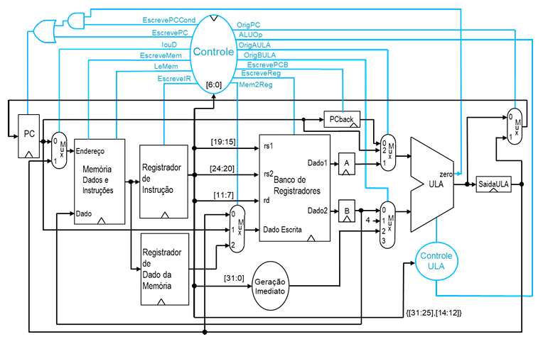

# Laboratório 3 - CPU RISC-V MULTICICLO

## Objetivos

- Treinar o aluno com a Linguagem de Descrição de Hardware (HDL) Verilog;
- Familiarizar o aluno com o software de síntese **QUARTUS Prime**;
- Desenvolver a capacidade de análise e síntese de sistemas digitais usando uma HDL;
- Implementar uma CPU **Multiciclo** compatível com a ISA **RV32I reduzida**.

---

## <small>(10.0)</small> **1.** Implementação do Processador Multiciclo

Implemente o processador **Multiciclo** com ISA reduzida com as instruções: **add, sub, and, or, slt, lw, sw, beq, jal**, 
e ainda as instruções **jalr, addi e lui**.

O projeto **TopDE.qar** possui o arcabouço para o desenvolvimento e teste do seu processador.

Os blocos **Banco de Registradores**, **Gerador de Imediatos**, **ULA**, **Controlador da ULA**, e o programa `de1.s` são os mesmos do processador **Uniciclo**.

---

### <small>(1.0)</small> **1.1.** Arquitetura Von Neumann - Memória Única

Na **Arquitetura Von Neumann**, dados e programas na mesma memória implicam que a memória de código deve ser gravável do mesmo modo que a memória de dados.

Logo, basta colocar o **controle igual das duas memórias**, apenas selecionando, pelo endereço, qual dos dois blocos deve ser utilizado.

**Explique como isso foi feito no seu processador.**

---

### <small>(1.0)</small> **1.2.** Acesso à memória IP do Quartus

O bloco de **memória IP** utilizado pelo Quartus necessita **2 ciclos de clock** para acesso.

Explique **quais alterações podem ser feitas no Diagrama de Estados** de modo a **otimizar esse acesso**.

---

### <small>(3.0)</small> **1.3.** Bloco Controlador

Implemente o **Bloco Controlador** e desenhe a **máquina de estados do controle**.

---

### <small>(5.0)</small> **1.4.** Implementação do Processador Multiciclo Completo

Implemente o **Processador Multiciclo completo**.

#### <small>(1.0)</small> **(a)** Visualize os blocos funcionais com o **netlist RTL view**.

#### <small>(1.0)</small> **(b)** Levante os requisitos físicos e temporais do seu processador.

#### <small>(1.5)</small> **(c)** Faça a simulação por forma de onda funcional e temporal com o programa `de1.s`, mostrando o funcionamento correto da CPU.

#### <small>(1.5)</small> **(d)** Qual a máxima frequência de clock utilizável na sua CPU? Verifique experimentalmente mudando a frequência **CLOCK** e apresentando a simulação temporal por forma de onda.
